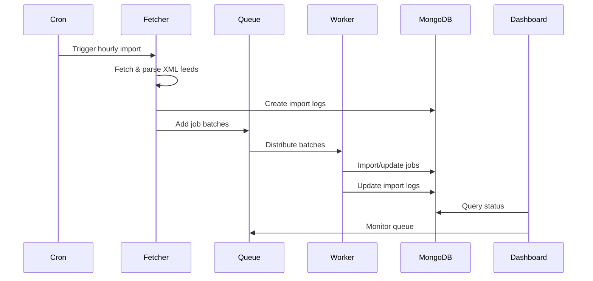

# System Architecture

## Overview

The Job Import System follows a microservices-oriented architecture designed for scalability, reliability, and maintainability. The system is divided into distinct components that can be scaled independently based on load requirements.

## Core Components

### 1. API Server (Express)

The API server is the central hub that:
- Exposes RESTful endpoints for the admin dashboard
- Manages import triggers and history
- Provides queue management capabilities
- Handles authentication and authorization (future enhancement)

**Key Responsibilities:**
- Request validation and routing
- Business logic coordination
- Database queries for reporting
- Real-time status updates

### 2. Worker Pool

Worker processes handle the heavy lifting:
- Process job batches from the queue
- Import jobs into MongoDB
- Track import progress and failures
- Update import logs

**Scaling Strategy:**
- Multiple worker instances can run concurrently
- Configurable concurrency per worker
- Automatic job distribution via Redis

### 3. Job Fetcher Service

Responsible for external API integration:
- Fetches XML/RSS feeds from configured sources
- Converts XML to JSON format
- Validates and normalizes job data
- Batches jobs for queue processing

**Design Patterns:**
- Factory pattern for different feed parsers
- Strategy pattern for source-specific parsing
- Adapter pattern for data normalization

### 4. Queue System (Redis + Bull)

The queue provides:
- Job persistence and distribution
- Retry mechanisms with exponential backoff
- Priority queuing (future enhancement)
- Dead letter queue for failed jobs

**Queue Design:**
```
┌─────────────┐
│  Job Batch  │ → { importLogId, source, batch[], metadata }
└─────────────┘
       ↓
┌─────────────┐
│   Redis     │ → Persistent storage
└─────────────┘
       ↓
┌─────────────┐
│   Worker    │ → Concurrent processing
└─────────────┘
```
┌─────────────┐
│   Worker    │ → Concurrent processing
└────────────────

### 5. Admin Dashboard (Next.js)

Modern React-based UI providing:
- Real-time import monitoring
- Queue management interface
- Historical data visualization
- Manual import triggers

**Technical Stack:**
- Next.js 14 with App Router
- TypeScript for type safety
- Tailwind CSS for styling
- Real-time updates via polling (WebSocket future enhancement)

## Data Flow



## Database Design

### Jobs Collection

```javascript
{
  _id: ObjectId,
  externalId: String (unique),
  title: String,
  description: String,
  company: String,
  location: String,
  category: String,
  jobType: String,
  salary: String,
  url: String,
  applyUrl: String,
  publishedDate: Date,
  source: String,
  additionalData: Object,
  firstImportedAt: Date,
  lastUpdatedAt: Date,
  updateCount: Number,
  createdAt: Date,
  updatedAt: Date
}
```

### Import Logs Collection

```javascript
{
  _id: ObjectId,
  fileName: String (source URL),
  totalFetched: Number,
  totalImported: Number,
  newJobs: Number,
  updatedJobs: Number,
  failedJobs: Number,
  failedJobDetails: [{
    externalId: String,
    reason: String,
    error: Object,
    timestamp: Date
  }],
  startTime: Date,
  endTime: Date,
  duration: Number,
  status: String (pending|processing|completed|failed),
  error: Object,
  metadata: Object,
  createdAt: Date,
  updatedAt: Date
}
```

## Scalability Considerations

### Horizontal Scaling

1. **API Servers**: Load balanced behind nginx/HAProxy
2. **Workers**: Auto-scale based on queue depth
3. **MongoDB**: Replica sets for read scaling
4. **Redis**: Redis Cluster for queue scaling

### Performance Optimizations

1. **Batch Processing**: Jobs processed in configurable batches
2. **Database Indexes**: Optimized queries with proper indexing
3. **Connection Pooling**: Reused database connections
4. **Caching**: Future enhancement for frequently accessed data

### Monitoring & Observability

1. **Application Metrics**:
   - Import success/failure rates
   - Processing times
   - Queue depths
   - API response times

2. **Infrastructure Metrics**:
   - CPU/Memory usage
   - Database performance
   - Redis memory usage
   - Network latency

3. **Logging Strategy**:
   - Structured logging with correlation IDs
   - Log aggregation (ELK stack recommended)
   - Error tracking (Sentry integration)

## Security Considerations

1. **API Security**:
   - CORS configuration
   - Rate limiting (future)
   - API key authentication (future)

2. **Data Security**:
   - MongoDB connection encryption
   - Redis password protection
   - Environment variable management

3. **Input Validation**:
   - XML parsing protection
   - Data sanitization
   - Schema validation

## Deployment Architecture

### Development Environment
```
┌──────────────┐     ┌──────────────┐     ┌──────────────┐
│   Frontend   │     │   Backend    │     │   Worker     │
│  localhost   │────▶│  localhost   │────▶│  localhost   │
│    :3000     │     │    :5000     │     │   Process    │
└──────────────┘     └──────────────┘     └──────────────┘
        │                    │                     │
        └────────────────────┴─────────────────────┘
                             │
                    ┌────────┴────────┐
                    │  Local MongoDB  │
                    │  Local Redis    │
                    └─────────────────┘
```

### Production Environment
```
┌──────────────┐     ┌──────────────┐     ┌──────────────┐
│   Vercel     │     │   Render     │     │   Worker     │
│   Next.js    │────▶│   API Server │────▶│   Container  │
│     CDN      │     │   Container  │     │   (Multiple) │
└──────────────┘     └──────────────┘     └──────────────┘
        │                    │                     │
        └────────────────────┴─────────────────────┘
                             │
                    ┌────────┴────────┐
                    │ MongoDB Atlas   │
                    │ Redis Cloud     │
                    └─────────────────┘
```

## Future Enhancements

1. **Real-time Updates**: WebSocket/SSE for live dashboard updates
2. **Advanced Queuing**: Priority queues, scheduled imports
3. **Data Pipeline**: ETL for analytics and reporting
4. **Multi-tenancy**: Support for multiple organizations
5. **API Gateway**: Centralized API management
6. **Microservices**: Further decomposition of services
7. **Event Sourcing**: Complete audit trail of all operations
8. **Machine Learning**: Job deduplication and categorization

## Decision Log

### Technology Choices

1. **Node.js/Express**: Chosen for JavaScript ecosystem consistency and async I/O performance
2. **MongoDB**: Document flexibility for varying job schemas
3. **Redis/Bull**: Proven queue solution with persistence and reliability
4. **Next.js**: Modern React framework with SSR/SSG capabilities
5. **TypeScript**: Type safety for maintainable code

### Architectural Patterns

1. **Service-Oriented**: Clear separation of concerns
2. **Queue-Based**: Decoupled processing for reliability
3. **Repository Pattern**: Data access abstraction
4. **Factory Pattern**: Extensible feed parsers
5. **Observer Pattern**: Event-driven queue processing

### Trade-offs

1. **Polling vs WebSockets**: Chose polling for simplicity, WebSockets planned
2. **Monorepo vs Polyrepo**: Monorepo for easier development
3. **REST vs GraphQL**: REST for simplicity and caching
4. **Process vs Container**: Process-based workers for development simplicity 